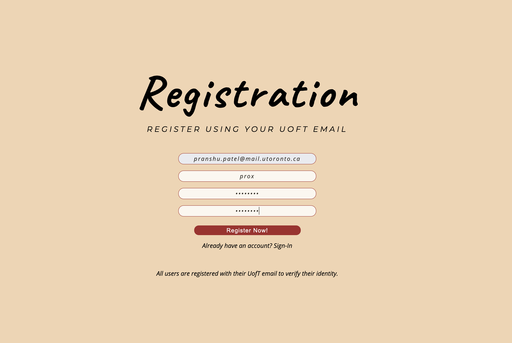
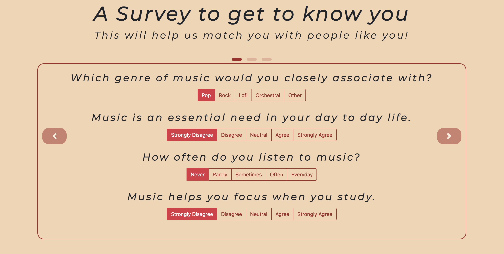
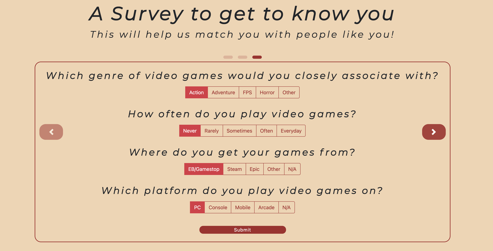
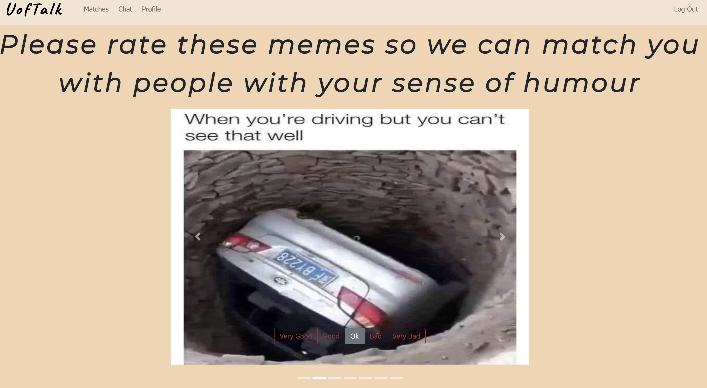
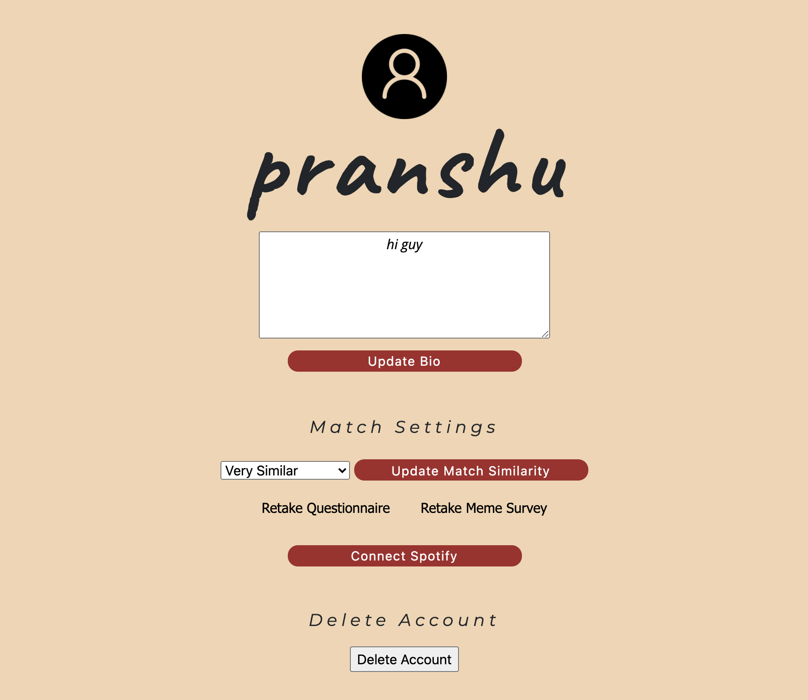
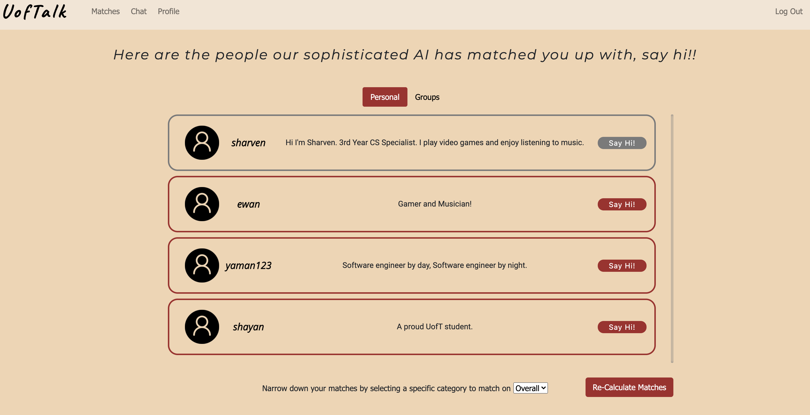
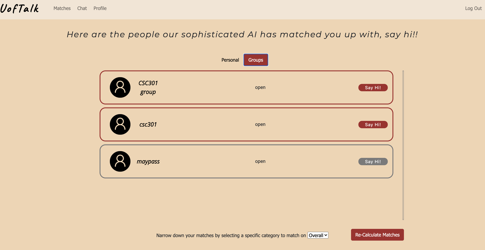
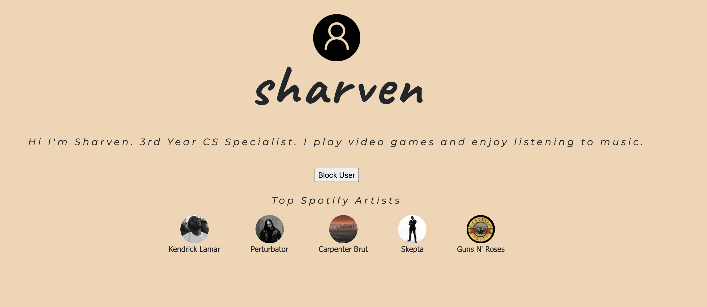
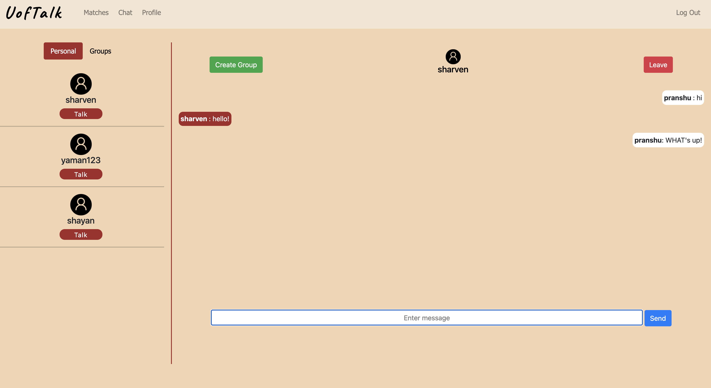
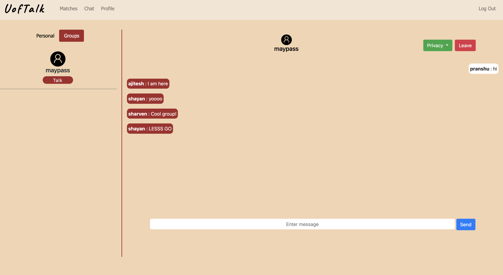

# UofTalk : Boundless Connections
UofTalk is a social media web app for UofT students made by team MAY-PASS. This is a copy of the original code/repo.

Website Link: https://uoftalk.herokuapp.com/login (Site is no longer up)

*This is a copy of the latest code from the original repo. The original repo had ~450 commits, ~75 branchs, and ~20 pull requests as part of our git flow/scrum development process*

## Members
- Manav Bhojak
- Abhay Kaushik
- Yaman Abouyouniss
- Pranshu Patel
- Ajitesh Misra
- Shayan Imam
- Sharven Prasad Dhanasekar

## Repository structure

```
doc
├── sprint[n]: Required documentation for sprint n
└── wireframes: Wireframe designs

flask-app
├── static: Static resources for the webpages such as css and images
├── templates: Jinja html templates for all webpages in the app
├── app.py: The main flask app
├── authennticator.py: Handles all operations related to authentication
├── communication_handler.py: Handles all operations related to messaging
├── matcher.py: Handles all operations related to matching
├── mongodriver.py: MongoDB DAO
├── observer.py: Observer pattern utility
├── add_dummy.py: Populate the database with dummy users
├── requirements.txt: All python packages used in the project
└── README.md 

matching-model
├── datasets
|	└── [category].npy: The K-means datamatrix for this category
├── generate_data.py: Generate random datamatrix for each category
└── README.md

trained-models
└── k-means-model-[category]-[k].model: The K-means model for the given category and the given k value

```

# UofTalk Website Walkthrough

### Step 1: Register with UofT Email


### Step 2: Complete Questionnaire and Meme Survey
#### Questonnaire



#### Meme Survey


### Step 3: View your profile, update your bio, link your spotify, and update your "match" similarity settings.


### Step 4: Check out your Personal and Group Chat Matches on the "Matches" Page. Start new chats, or continue existing ones!
#### Individual Matches based on questionnaire

#### Group chats that are available for you to chat in (Grey Button means user has already joined that chat)

#### View other peoples profile page


### Step 5: Chat with individual matches and groups!


